<div align="center">


# Curio

**Read. Wonder about a word. Click it — the answer is right there, in context.**

[](https://react.dev)
[](https://www.typescriptlang.org)
[](https://vite.dev)


<br />

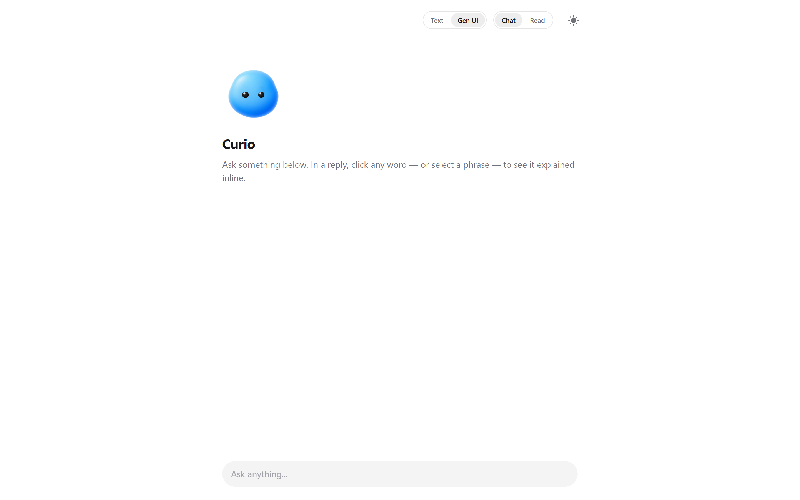
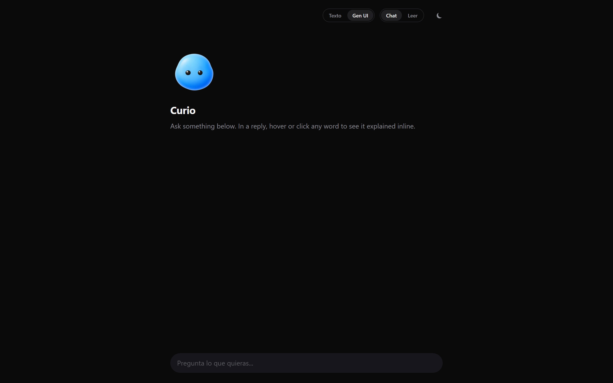

</div>

---

**Curio** is a local-first reading companion. Read a reply from an LLM (or paste any article), click a word — or select a phrase — and a full explanation appears **in place, in context**. The word never leaves the sentence it lives in, so "Mercury" in a chemistry paragraph is not "Mercury" next to "planet". Nothing is underlined at rest: curiosity is met on the click, never advertised.

> **Use it when you read to learn and don't want to leave the text to look things up.**

## Why Curio?

| In context, in place | Curiosity, not clutter | Composed, not dumped |
| :--- | :--- | :--- |
| Every word is explained against its own sentence — click or select, and the answer opens inline. No tab-hopping. | Nothing is flagged or underlined. The page reads as prose; a word only lights up under your cursor. | "See more" grows into a panel the model **builds** from a validated component catalog, never a wall of text. |

## At a glance

```text
read  →  hover a word (it lights up)  →  click
                                           │
                     ┌─────────────────────┴─────────────────────┐
                     ▼                                            ▼
             one-sentence glance                       "See more" → composed panel
                                                          ├── click a word inside → go deeper (breadcrumb)
                                                          └── ask a follow-up → answered in place
```

<div align="center">

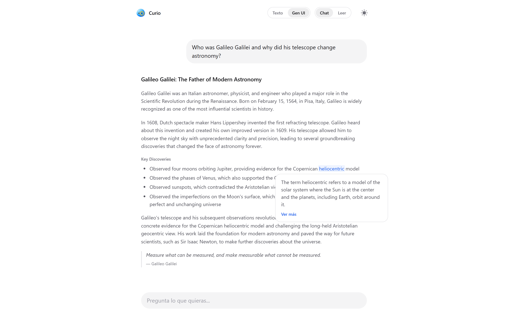

</div>

## What you can do

| Capability | What it does |
| :--- | :--- |
| **Click a word** | An explanation for that word, in its sentence. Every word is clickable; none is underlined at rest. |
| **Select a phrase** | 2+ words are explained as one unit, under a single continuous highlight. |
| **Chat + Read** | Converse with an LLM, or switch to **Read** and paste an article — same click-to-explain on any text. |
| **"See more" panel** | The glance grows into a panel the model composes for the term: heading, explanation, definition card, key figure, and a closing callout on what the term is doing in *this* text. |
| **Explorable panel** | Words inside the panel are clickable too; "See more" goes one level deeper, with a back arrow and a breadcrumb trail. |
| **Follow-ups in place** | A composer at the foot of the panel answers as components too — the thread never dead-ends. |
| **Describe images** | With a vision-capable model, click an image and Curio describes it in the same popover / panel. |
| **Plain text or Gen UI** | Gen UI mode has the model pick components from a catalog (cards, tables, timelines, charts…) and fill them with **validated** data, falling back to text if anything is off. |
| **Pluggable brain** | Local **Ollama** or any **OpenAI-compatible** API with your own key (Groq, OpenRouter, LocalAI, your own server…). |
| **Configurable language** | One **EN / ES** switch drives the UI *and* the language the model answers in — prompts included. |
| **Light & dark** | Follows your system, or force it by hand. |
| **A living mascot** | Breathes, follows the cursor, travels from hero to header when the chat starts, and dons a monocle while it inspects a term. |

<div align="center">

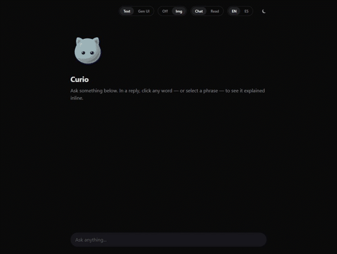

</div>

The panel is composed from components, and it is explorable — click a word inside it (here **geocentric**), walk one level deeper, and a breadcrumb tracks where your curiosity went:

<div align="center">

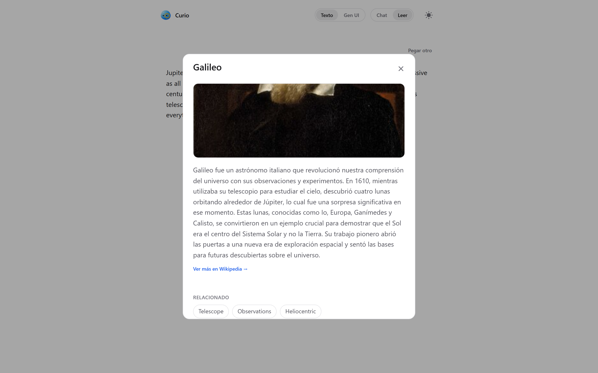

</div>

<div align="center">

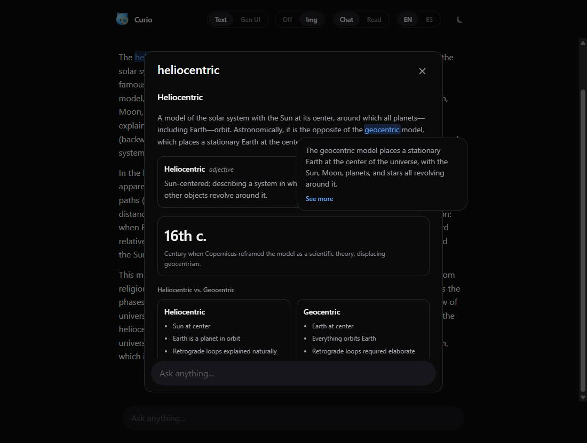
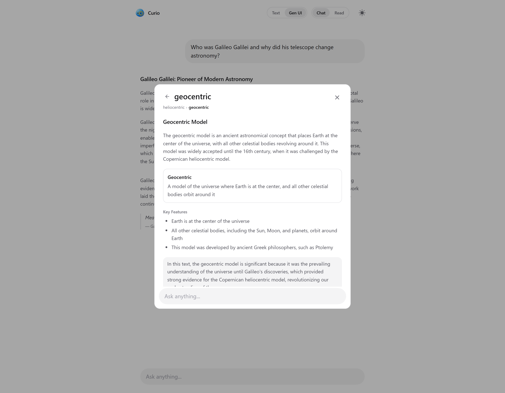

</div>

Or just ask — the panel's composer answers in components too, without taking you out of the text:

<div align="center">

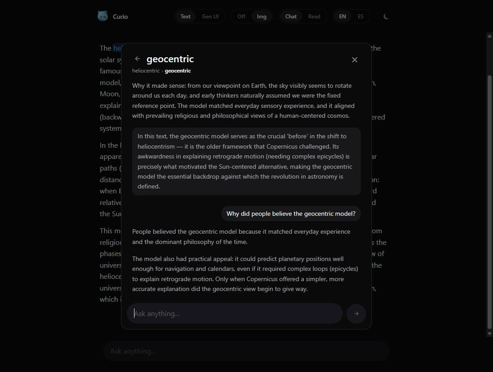

</div>

In **Gen UI** the model reaches for the piece that fits — stat and bar components to rank the planets, line charts for a trend:

<div align="center">

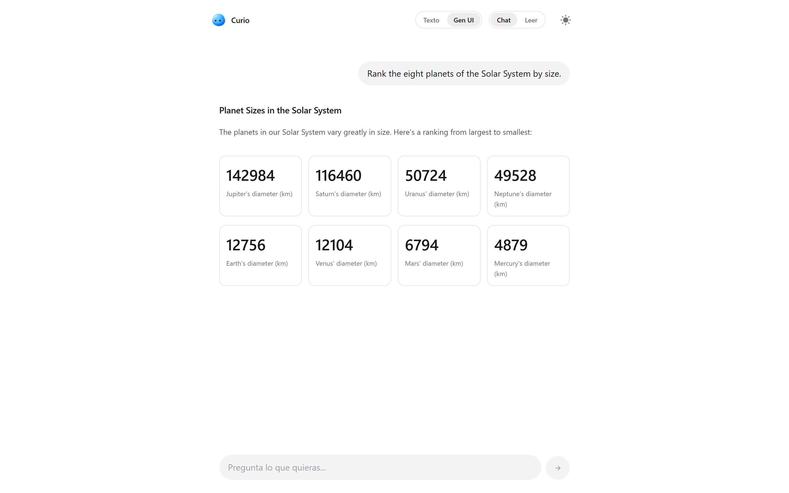
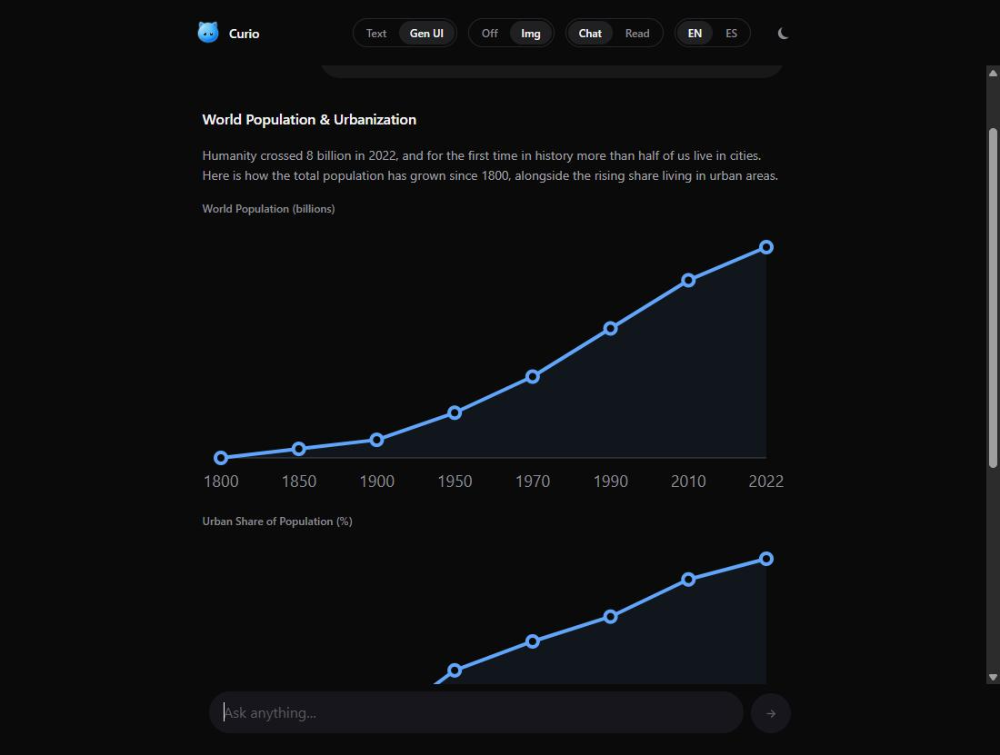

</div>

## Quick start

**Requirements:** Node 18+. For the local brain, [Ollama](https://ollama.com) running locally (optional if you use a cloud endpoint).

```bash
git clone https://github.com/JoseEstevez520/curio.git
cd curio
npm install
npm run dev            # http://localhost:5173
```

Then pick a brain:

| Brain | Setup | Notes |
| :--- | :--- | :--- |
| **Ollama (local, default)** | `ollama serve` then `ollama pull llama3.2:3b` | No keys, works offline. The dev server proxies `/ollama`, so no CORS and no `OLLAMA_ORIGINS`. |
| **Cloud (bring-your-own-key)** | Set the endpoint + key in `apps/web/.env.local` | Any OpenAI-compatible API. **[Groq](https://groq.com)** recommended for speed (makes Gen UI snappy). |

```ini
# apps/web/.env.local — gitignored, never committed
VITE_BRAIN=groq                                 # boot into the cloud; without a key, boots on Ollama
VITE_CLOUD_BASE_URL=https://api.groq.com/openai/v1
VITE_GROQ_API_KEY=your_key_here                 # accepts several keys, comma-separated (rotates on 429)
VITE_GROQ_MODEL=openai/gpt-oss-20b              # Groq's lineup changes — see console.groq.com/docs/models
VITE_LOCALE=en                                   # UI + model output language: en | es
```

> **Your keys are yours.** They live only in your browser (localStorage) or `.env.local`, which is never committed — there are no keys in the repo. `VITE_*` values are inlined into the bundle at build time, so treat them as dev-only and never ship a production build with a real key baked in.

## Language

One **EN / ES** switch in the header sets the language Curio speaks — the UI strings **and** the language the model answers in (the language directive is injected into every prompt). Add a language by extending the locale table in `@curio/core`.

## Browser extension

The same click-to-explain, on any web page (Manifest V3). It picks a brain by itself: the browser's built-in **Gemini Nano** first, then local **Ollama**, then a **cloud** endpoint you configure in the popup — same bring-your-own-key model as the web app, plus the EN/ES language switch and image describe.

```bash
npm run build:ext      # then load apps/extension/dist as an unpacked extension
```

## How it works

At the core is a **brain seam**: the whole engine talks to an abstract `LlmProvider`, with interchangeable implementations behind it — **Ollama** (local), **OpenAI-compatible** (cloud), and the browser's **Gemini Nano** (extension). Switching brains never serves a cached answer from a different one: the cache key includes the model's identity and the language.

- **Entities + lazy loading.** Nothing is computed ahead of time. The one-sentence glance is generated on demand from the word plus its context sentence; the deeper panel starts as the glance opens, so "See more" is usually ready.
- **A component catalog (Gen UI).** The model's job is **classify + fill**, never author markup: it picks pieces from a fixed catalog and returns data, validated with **Zod** before rendering; on any mismatch it falls back to plain text and the UI never breaks. Panels are composed through [OpenUI](https://www.openui.com); every piece emits clickable word spans, so a generated panel is as explorable as a paragraph.
- **Multimodal.** Messages carry images (data URLs); each provider serializes them (Ollama base64, OpenAI `image_url`). A vision-capability check gates the image-describe flag.
- **Monorepo.** The click-to-explain lives in a portable core shared across surfaces:

  ```text
  packages/core   @curio/core — the engine: brain seam, Zod catalog, prompts (locale-aware),
                  two-stage generation, tokenizer, i18n.
  apps/web        The web app (chat + Read mode).
  apps/extension  Browser extension (MV3): click → description on any page.
  ```

Full detail in [`docs/ARCHITECTURE.md`](docs/ARCHITECTURE.md).

## Read mode

Flip to **Read**, paste an article, and the same engine works on any text — Markdown is honoured, every word is clickable. With **Gen UI** on, the reader re-expresses the text as cards, figures, a timeline, a pull quote — nothing invented, only rearranged for skimming.

<div align="center">

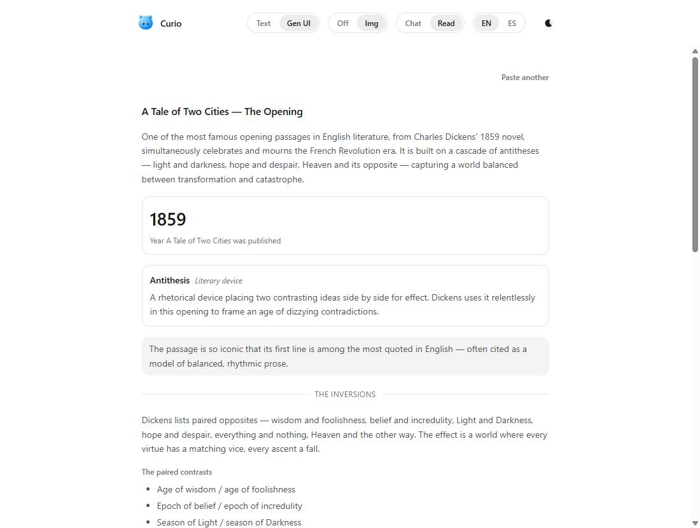
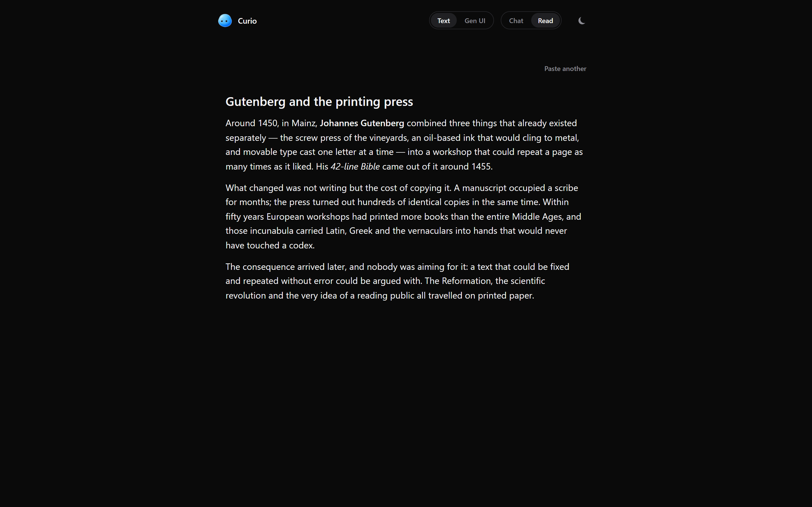

</div>

## What Curio is not

- **Not a dictionary.** It explains a word *as used here*, reading the surrounding sentence — not a generic definition.
- **Not a link farm.** Nothing is underlined or flagged at rest; the text reads as prose.
- **Not cloud-only.** Local-first via Ollama; a cloud key is optional, lives only in your browser, and is never committed.
- **Not a markup generator.** The model fills a validated component catalog; it never writes raw HTML into the page.

## Design & philosophy

Monochrome and shadow-free: hierarchy from **whitespace** and **1px hairlines**, not floating boxes. Motion follows one idea — *everything flows to one place*: the popover **grows** into the panel, the mascot **travels** from hero to header. Depth from movement, never a shadow. Full system in [`docs/DESIGN.md`](docs/DESIGN.md).

## Status & roadmap

| Done | |
| :--- | :--- |
| **v0** | Plain-text explanation on click, whole loop local via Ollama. |
| **v1** | The chat done right: glance → panel + generative UI with a validated catalog. |
| **Explorable panels** | Click deeper, breadcrumb back, ask follow-ups in place — all composed. |
| **Configurable language** | One EN/ES switch drives UI and model output across web + extension. |
| **Any API + multimodal** | Cloud bring-your-own-key in the extension too; click an image to describe it. |

**Next:** entity detection and idle prefetch (so the first click feels instant); **level-3 Gen UI** (the model authoring the interface, not just filling it); personalized descriptions; a desktop app with a knowledge vault.

Slices in [`docs/ROADMAP.md`](docs/ROADMAP.md). More context: [`IDEA.md`](IDEA.md) · [`docs/ARCHITECTURE.md`](docs/ARCHITECTURE.md) · [`docs/DESIGN.md`](docs/DESIGN.md) · [`CHANGELOG.md`](CHANGELOG.md).

## Scripts

| Script | What it does |
| :--- | :--- |
| `npm run dev` | Web app in dev (Vite). |
| `npm run build` | Production build (`tsc` + Vite). |
| `npm run build:ext` | Build the browser extension. |
| `npm run test` | Tests (Vitest; `test:watch` too). |
| `npm run lint` | ESLint (`lint:fix` to autofix). |
| `npm run typecheck` | TypeScript type checking. |

Two surfaces live behind URL flags: **`/?gallery`** renders every component, **`/?openui`** is a bare composition playground.

## Contributing

Work happens in **small slices** (one slice = one commit) and `main` stays demoable. Before a PR: `npm run lint && npm run typecheck && npm run test`. If you touch styling, respect what's sacred — monochrome, no shadows, local by default — see [`docs/DESIGN.md`](docs/DESIGN.md) and [`CLAUDE.md`](CLAUDE.md).

## License

Not settled yet (**MIT** is on the table for an open POC — the owner's call). Until a `LICENSE` file lands, all rights reserved by default.
