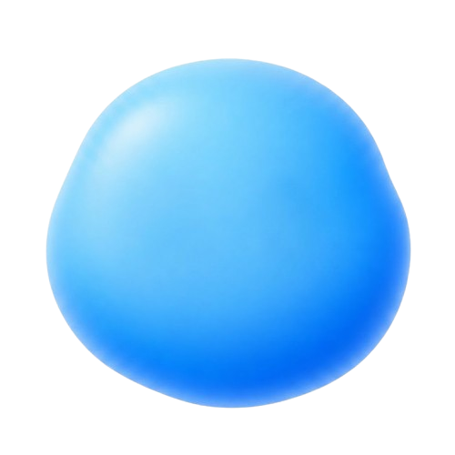

<div align="center">



# Curio

**Lee, haz clic en una palabra y entiéndela ahí mismo — sin salir del texto.**

_Para curiosos e investigadores. Cerebro local por defecto, sin claves de API._

<br />

[](https://react.dev)
[](https://www.typescriptlang.org)
[](https://vite.dev)
[](https://ollama.com)


<br />


</div>

---

## El baile de siempre

Has sido curioso toda la vida y siempre ha sido el mismo baile: **copiar, pegar, buscar,
volver.** Cada vez que aparece una palabra que no conoces tienes que salir del texto, ir a
buscarla y regresar. Eso no es para nosotros, los curiosos.

**Curio** rompe ese bucle. Lees un mensaje de un LLM (o pegas cualquier artículo), haces **clic
en una palabra** —o **seleccionas una frase**— y aparece una **descripción en contexto** justo
ahí, en un popover en línea. La misma palabra puede significar cosas distintas según lo que la
rodea ("Mercurio" en química no es "Mercurio" junto a "planeta"), así que Curio siempre lee la
frase completa antes de explicarte.

La curiosidad se **recompensa al clic, no se anuncia**: el texto se lee como prosa normal, sin un
campo de enlaces subrayados. Pasas el ratón por encima y solo entonces la palabra se ilumina,
invitándote. Y todo corre **en tu máquina**: por defecto, un modelo pequeño en **Ollama**, sin
claves de API y sin nube. Si quieres velocidad, puedes **traer tu propia clave** de cualquier
endpoint compatible con OpenAI (como Groq). Tú decides dónde vive el cerebro.

<!-- GIF a grabar por el dueño: click en una palabra dentro de una respuesta → aparece la descripción en contexto (el "vistazo"). Guardar en docs/media/click-to-explain.gif -->


> _El GIF de arriba está pendiente de grabar en vivo (requiere un cerebro activo). Mientras tanto,
> las capturas reales del estado inicial y del modo Leer sí son de la app funcionando._

## Qué puedes hacer

- 👆 **Clic en cualquier palabra → descripción en su contexto.** Cada palabra es clicable, pero
  nada se subraya en reposo: el texto se lee como prosa y la palabra solo se ilumina al pasar el
  ratón. Curiosidad recompensada, no señalizada.
- ✍️ **Selecciona una frase** (2+ palabras) y Curio te explica **toda la selección** como una
  unidad, resaltada en una banda azul continua.
- 💬 **Chat + modo Leer.** Conversa con un LLM, o cambia a **Leer** y **pega un artículo** para
  aplicar el mismo "clic → explicación" sobre texto arbitrario.
- 🔎 **"Ver más" — un panel vivo.** El popover pequeño (el _vistazo_, una frase) tiene un **"Ver
  más"** que **crece** hasta un modal con la explicación profunda. Cuando el LLM **confirma** que
  la palabra es una entidad real, el panel se enriquece con **foto y datos de Wikipedia** — la
  descripción siempre la escribe el modelo; la foto solo aparece si está blindada por esa
  confirmación.
- 🎨 **Texto o Gen UI.** En modo **Gen UI**, en vez de un párrafo el modelo **elige un componente
  de un catálogo** (ficha de definición, línea de tiempo, tabla comparativa, pasos…) y lo rellena
  con **JSON validado**, con caída a texto si algo falla. Nunca escribe HTML a mano.
- 🧠 **Cerebro enchufable, local por defecto.** **Ollama** sin configuración, o **cualquier API
  compatible con OpenAI** con tu clave (Groq, OpenRouter, LocalAI, tu propio servidor…).
- 🌗 **Temas claro y oscuro**, siguiendo tu sistema o forzados a mano.
- 🫧 **Mascota viva.** Curio respira, te sigue con la mirada, viaja del centro a la cabecera cuando
  escribes, se concentra al generar y saca el **monóculo** al inspeccionar un término.
- 🎛️ **Estética calmada:** monocroma, tipo Linear, **sin sombras** — jerarquía por espacio y
  filetes de 1px, con micro-animaciones que tienen intención.

<!-- GIF a grabar por el dueño: el logo/mascota haciendo morph del hero (centro grande) a la cabecera (pequeño) al escribir el primer mensaje. Guardar en docs/media/mascot-morph.gif -->


<!-- GIF a grabar por el dueño: componer una respuesta en modo Gen UI (aparece una ficha/tabla del catálogo en vez de texto) y abrir el modal "Ver más" con foto de Wikipedia. Guardar en docs/media/gen-ui-vermas.gif -->


## Arranque rápido

**Requisitos:** **Node 18+**. Para el cerebro local, **[Ollama](https://ollama.com)** corriendo
en tu máquina (opcional si vas a usar la nube).

```bash
git clone https://github.com/JoseEstevez520/curio.git
cd curio
npm install
npm run dev            # http://localhost:5173
```

### Opción A — Local con Ollama (sin claves, por defecto)

Arranca Ollama y descarga un modelo pequeño; la app arranca sola en **Local**:

```bash
ollama serve                 # daemon en http://localhost:11434
ollama pull llama3.2:3b      # o qwen2.5:3b-instruct; en equipos flojos, qwen2.5:1.5b
```

El frontend habla con Ollama a través del proxy **`/ollama`** del dev server de Vite: **sin CORS,
sin tocar `OLLAMA_ORIGINS`**. Funciona offline una vez descargado el modelo.

### Opción B — Nube con tu propia clave (rápido)

Para inferencia veloz (útil para la **Gen UI de más nivel**), enchufa **cualquier endpoint
compatible con OpenAI**. Puedes hacerlo desde **Ajustes → Cerebro: Nube** dentro de la app, o por
variables de entorno para desarrollo:

```bash
cp apps/web/.env.example apps/web/.env.local   # .env.local está gitignored
```

```ini
# Cualquier API compatible con OpenAI (Groq recomendado por su velocidad)
VITE_CLOUD_BASE_URL=https://api.groq.com/openai/v1
VITE_GROQ_API_KEY=tu_clave_aqui
VITE_GROQ_MODEL=llama-3.3-70b-versatile
VITE_BRAIN=groq                                 # arranca en la nube; sin clave, arranca en Ollama
```

> **Tus claves son tuyas.** Viven solo en tu navegador (localStorage) o en tu `.env.local`, que
> **nunca** se commitea. No hay claves en el repo. Nota: las variables `VITE_*` se incrustan en el
> bundle al compilar, así que trátalas como dev-only y **nunca** publiques un build con una clave
> real dentro.

### Otros scripts

| Script              | Qué hace                             |
| ------------------- | ------------------------------------ |
| `npm run build`     | Build de producción (`tsc` + Vite)   |
| `npm run preview`   | Sirve el build de producción         |
| `npm run test`      | Tests con Vitest (`test:watch` mira) |
| `npm run lint`      | ESLint (`lint:fix` para arreglar)    |
| `npm run typecheck` | Chequeo de tipos con TypeScript      |
| `npm run build:ext` | Build de la extensión de navegador   |

## Cómo funciona por dentro

El corazón de Curio es una **costura ("seam") del cerebro**: todo el motor habla con un
`LlmProvider` abstracto, y por debajo hay dos implementaciones intercambiables — **Ollama** (local)
y **OpenAI-compatible** (nube). La nube se alcanza por un **proxy dinámico de dev** (`/llm`): el
navegador manda la URL real del endpoint en una cabecera y el dev server la reenvía, así que **no
hay CORS** y sirve igual para Groq, OpenRouter, LocalAI o tu propio servidor. Cambiar de cerebro no
sirve nunca una respuesta cacheada de otro: la clave de caché incluye la identidad del modelo.

El resto de piezas:

- **Entidades + lazy loading.** Cualquier palabra (o selección) es clicable, pero **nada se
  calcula por adelantado**: la descripción se genera **bajo demanda** al hacer clic o hover, con la
  palabra + la frase de contexto, y se transmite en streaming al popover.
- **Wikipedia como enriquecimiento blindado.** En "Ver más", la foto y los hechos de Wikipedia solo
  aparecen cuando el LLM **confirma** la entidad — datos de referencia de la web abierta, sin clave,
  para dar base fiable; la descripción siempre es del modelo.
- **Catálogo de componentes (Gen UI).** El modelo hace **clasificar + rellenar**, nunca escribir
  markup: elige un `type` de un catálogo fijo y devuelve `data` en JSON. Todo se valida con **Zod**
  antes de renderizar; si algo no cuadra, **cae a texto plano** y la UI nunca se rompe.
- **Monorepo.** El "clic → descripción" vive en un **núcleo portable** que comparten las
  superficies:

  ```
  packages/core   @curio/core — el motor: seam del cerebro (Ollama / OpenAI-compat), catálogo Zod,
                  prompts, generación en dos etapas, cliente de Wikipedia, tokenizador.
  apps/web        La app web (chat + modo Leer). Consume @curio/core.
  apps/extension  Extensión de navegador (MV3): clic → descripción en cualquier página.
  ```

Detalle completo en [`docs/ARCHITECTURE.md`](docs/ARCHITECTURE.md).

## Modo Leer

Cambia el toggle a **Leer**, pega un artículo y aplica el mismo motor de "clic → explicación" sobre
texto arbitrario. Activa **Gen UI** para leerlo de forma más amena.

<div align="center">


</div>

## Estilo y filosofía de diseño

Curio es **monocromo, tipo Linear, sin sombras**: la jerarquía la dan el **espacio** y los
**filetes de 1px**, no las cajas flotantes. El movimiento sigue una idea — **"todo fluye a un
lugar"**: los elementos **se transforman y viajan** unos en otros (el popover **crece** hasta el
modal, la mascota **viaja** del hero a la cabecera) en vez de aparecer y desaparecer de golpe. La
profundidad la da el movimiento, nunca la sombra. El sistema completo está en
[`docs/DESIGN.md`](docs/DESIGN.md).

## Estado y roadmap

- ✅ **v0** — descripción en texto plano al clic, todo el bucle en local vía Ollama.
- ✅ **v1** — el chat bien hecho: **"poquito → más"** (popover → modal) + **UI generativa** con
  catálogo de componentes validados por Zod.
- 🔜 **v2** — **detección de entidades** y **prefetch** en ocioso para que el clic sea instantáneo.
- 🔭 **Rumbo:** **Gen UI de nivel 3** (el modelo autora la interfaz, apoyándose en el cerebro cloud
  rápido), **descripciones personalizadas** para cada usuario, y una **app de escritorio** con
  vault de conocimiento.

Detalle y slices en [`docs/ROADMAP.md`](docs/ROADMAP.md). Más contexto:
[`IDEA.md`](IDEA.md) · [`docs/ARCHITECTURE.md`](docs/ARCHITECTURE.md) ·
[`docs/DESIGN.md`](docs/DESIGN.md) · [`docs/niveles-generativos.md`](docs/niveles-generativos.md) ·
[`CHANGELOG.md`](CHANGELOG.md) · [`EXPERIMENTS.md`](EXPERIMENTS.md).

## Contribuir

Se trabaja por **slices pequeños** (un slice = un commit con mensaje claro) y `main` siempre queda
demoable. Antes de un PR: `npm run lint && npm run typecheck && npm run test`. Si tocas el estilo,
respeta lo **sagrado** (monocromo, sin sombras, local por defecto) — ver `docs/DESIGN.md` y
`CLAUDE.md`.

## Licencia

Aún sin definir (se baraja **MIT** para un POC abierto — decisión del dueño). Hasta que se añada un
fichero `LICENSE`, todos los derechos reservados por defecto.
