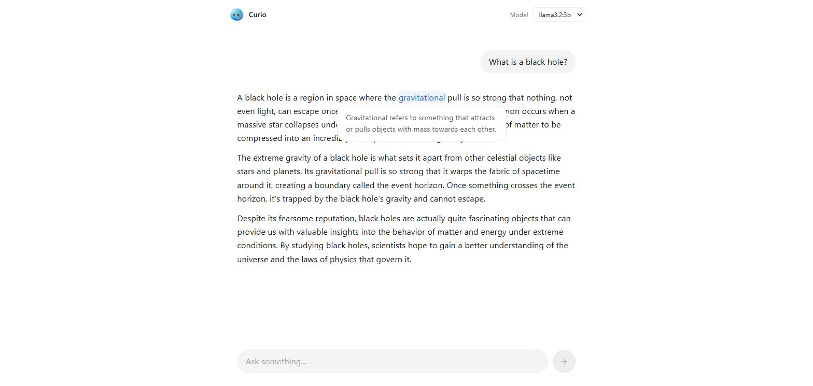

<div align="center">


# Curio

**Lee, haz clic en una palabra y entiéndela ahí mismo — sin salir del texto.**

_Read a message, click any word, get its description inline — local-first, no API keys._

<br />

[](https://react.dev)
[](https://www.typescriptlang.org)
[](https://vite.dev)
[](https://tailwindcss.com)
[](https://ollama.com)


<br />



</div>

---

## ¿Qué es?

Curio es una **superficie de lectura local-first**. Lees un mensaje de un LLM (o cualquier texto) en un chat limpio, haces **clic en cualquier palabra** —o **seleccionas una frase**— y aparece una **descripción en contexto** justo ahí, en un popover en línea. Sin copiar, pegar, buscar y volver.

Todo corre en tu máquina a través de **Ollama** con modelos pequeños: **sin claves de API y sin nube**.

## Características (v0)

- 💬 **Chat local con Ollama** en streaming, con selector del modelo instalado.
- 👆 **Clic en cualquier palabra** → descripción de esa palabra en su contexto.
- ✍️ **Selecciona una frase** (2+ palabras) → descripción de todo lo seleccionado.
- 📝 **Markdown en las respuestas** (negritas, listas, encabezados, código, tablas) manteniendo cada palabra clicable.
- ⚡ **Caché por término** (mensaje + palabra) para no recalcular lo ya visto.
- 🌐 **Responde en el idioma de la conversación**.
- 🎛️ **Streaming del descriptor** con cierre por Escape o clic fuera; banner amable si Ollama no corre o no hay modelos.
- 🎨 **Estilo monocromo tipo iOS/Linear, sin sombras** — jerarquía por espacio y filetes de 1px.
- 🫧 **Mascota viva (Curio)** — respira, te sigue con la mirada y hace _morph_ del centro a la cabecera al escribir; se concentra mientras genera, hace _squish_ al pulsarla y saca el **monóculo** cuando busca un término.

## Cómo funciona

La idea son tres piezas:

- **Entidades** — cualquier palabra (o selección) del mensaje es clicable.
- **Lazy loading** — nada se calcula por adelantado: la descripción se genera **bajo demanda** al hacer clic o seleccionar.
- **Modelo pequeño local** — la descripción la genera un modelo pequeño en **Ollama**, con la palabra + la frase de contexto, y se transmite en streaming al popover.

Lo que viene en **v1** es la **UI generativa**: en vez de texto plano, el modelo elige un **componente de un catálogo fijo** (ficha de definición, línea de tiempo, tabla comparativa, mapa, etc.) y devuelve **JSON estructurado** que la app valida y renderiza. Detalle en [`docs/ARCHITECTURE.md`](docs/ARCHITECTURE.md).

## Empezar

**Requisitos:** **Node 18+** y **[Ollama](https://ollama.com)** corriendo en local (sin API keys).

1. **Arranca Ollama** y descarga un modelo pequeño:

   ```bash
   ollama serve                 # deja el daemon en http://localhost:11434
   ollama pull llama3.2:3b      # o qwen2.5:3b-instruct; en equipos flojos, qwen2.5:1.5b
   ```

2. **Instala y levanta la app:**

   ```bash
   npm install
   npm run dev                  # http://localhost:5173
   ```

El frontend habla con Ollama a través del proxy **`/ollama`** del dev server de Vite, así que **no hay que tocar CORS ni `OLLAMA_ORIGINS`**.

### Otros scripts

| Script              | Qué hace                          |
| ------------------- | --------------------------------- |
| `npm run build`     | Build de producción (`tsc` + Vite)|
| `npm run preview`   | Sirve el build de producción      |
| `npm run lint`      | ESLint (`lint:fix` para arreglar) |
| `npm run typecheck` | Chequeo de tipos con TypeScript   |
| `npm run format`    | Prettier (`format:check` sólo mira)|

## Stack

**Usado hoy (v0):**

- **Vite 6** — dev server y build (incluye el proxy `/ollama`).
- **React 18** + **TypeScript** — UI y tipos como contrato.
- **Tailwind CSS** — estilos monocromos, sin librería de componentes.
- **Zustand** — estado del chat y la UI.
- **Floating UI** (`@floating-ui/react`) — posicionamiento del popover en línea.
- **react-markdown** + **remark-gfm** — render de las respuestas en Markdown.

**Próximamente (v1):** **Zod** para validar el JSON del catálogo de UI generativa (aún no instalado).

## Estado y roadmap

- ✅ **v0.0** (tag [`v0.0`](https://github.com/JoseEstevez520/curio/releases/tag/v0.0)) — descripción en texto plano al clic, todo el bucle funcionando en local.
- 🔜 **v1** — **UI generativa** (catálogo de componentes elegidos y rellenados por el modelo).

Detalle y slices en [`docs/ROADMAP.md`](docs/ROADMAP.md). Más contexto:

- [`IDEA.md`](IDEA.md) — qué es Curio y por qué.
- [`docs/ARCHITECTURE.md`](docs/ARCHITECTURE.md) — stack, entidades, Ollama, UI generativa.
- [`docs/DESIGN.md`](docs/DESIGN.md) — sistema de diseño (monocromo, Linear, sin sombras).
- [`docs/logo/`](docs/logo/) — el taller de la mascota: spec de animaciones (`logo.md`) y prototipos.
- [`docs/AGENTS.md`](docs/AGENTS.md) — el equipo de agentes.
- [`CHANGELOG.md`](CHANGELOG.md) · [`EXPERIMENTS.md`](EXPERIMENTS.md) — histórico y pruebas.

## Privacidad / local-first

Todo corre en **local** a través de **Ollama**: los modelos, las respuestas del chat y las descripciones. **Sin claves de API, sin llamadas a la nube.** Funciona offline una vez tienes el modelo descargado.
