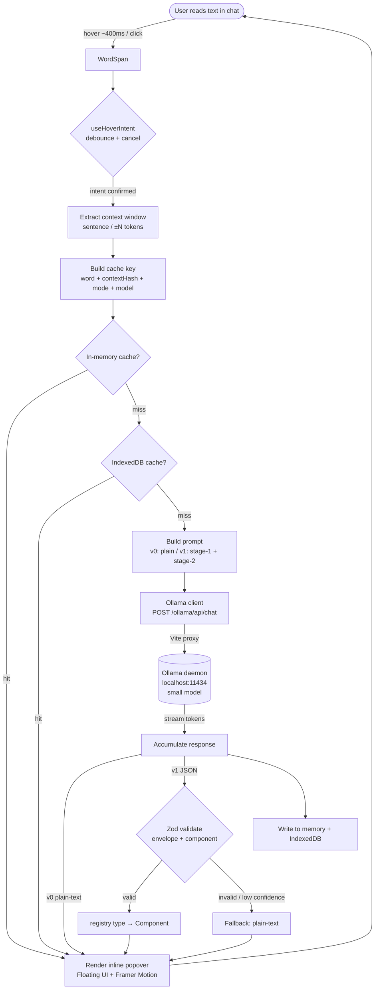

# Curio — Technical Architecture

> Read a message from an LLM (or any text) in a clean chat. Click or hover a word, and a description appears **right there, inline** — no leaving the text, no copy-paste-search-return.

---

## 1. High-level overview

Curio is a **local-first, web-based reading surface**. The first product surface is a clean chat UI: you paste or receive text, and any interesting word or entity becomes a soft affordance you can click or hover. When you do, Curio asks a **small local model running in Ollama** to explain that word *in the context of the surrounding text*, and it renders the answer inline as a popover anchored to the word — never a modal, never a new page, never a round-trip to a search engine. The whole point is to keep your eyes on the text and reward curiosity with zero friction.

There are two product modes shipped as **versions of the same pipeline**. In **v0**, the model returns a short **plain-text** explanation and we render it as-is. In **v1**, the model returns **structured JSON** that (a) picks one component from a **fixed catalog** (definition card, timeline, comparison table, map, person card, etc.) and (b) fills that component's typed data. The frontend renders **pre-built** components — the model never emits HTML or free-form markup. This is the single most important design decision in Curio: small local models are unreliable HTML authors but reliable JSON fillers when you constrain them to a schema. By moving all layout/markup into vetted components and asking the model only to *classify + populate*, we get "generative UI" that is actually robust on a 1–4B model.

Everything runs on the user's machine: the frontend is a static web app talking to Ollama at `http://localhost:11434`. There are **no API keys and no cloud calls**. The build target is a **small POC first** (chat + click-to-explain plain text) that grows along a clear path (hover, caching, NER, generative UI) without rewrites. The architecture is deliberately boring and decisive so it can be built in a weekend and extended for months.

---

## 2. Tech stack (decisive)

| Concern | Choice | Why |
|---|---|---|
| **Language** | **TypeScript** | Typed JSON is the backbone of the generative-UI catalog; types are the contract between model output and components. Non-negotiable. |
| **Frontend framework** | **React 18** | Largest ecosystem, best popover/positioning libraries, and pairs with Framer Motion (already a preferred tool) for the inline reveal animation. Component catalog = React components, one-to-one with schema. |
| **Build tool / dev server** | **Vite** | Instant dev server, trivial `server.proxy` to reach Ollama without CORS pain, static production build. |
| **Styling** | **Tailwind CSS** | Fast to build a clean, consistent chat + popovers without a component-library aesthetic. Utility classes keep the catalog components small and self-contained. |
| **Popover positioning** | **Floating UI** (`@floating-ui/react`) | Purpose-built for anchored tooltips/popovers with flip/shift/collision handling — exactly the inline-anchor problem. |
| **Animation** | **Framer Motion** | Smooth reveal/entry for the inline description; matches existing preference. |
| **State / async** | **Zustand** + **TanStack Query** | Zustand for chat + UI state (tiny, no boilerplate, no OOP ceremony). TanStack Query gives us request dedup, caching, and cancellation for lookups almost for free. |
| **Local server** | **None in v0** (Vite dev proxy); a **thin Node/Fastify proxy** only if/when we ship a packaged app | Keep the POC to a single static app. Add a 50-line proxy later for CORS-free production + prompt/caching centralization. |
| **Schema validation** | **Zod** | One source of truth: Zod schema → TypeScript type → JSON Schema (for the model's structured output). Validate every model response before rendering. |

**Guiding principle:** minimal, modern, and buildable by one person. No backend database, no auth, no bundler config beyond Vite defaults.

---

## 3. Entity detection — which words are clickable?

We need to decide **what the user can click**. Three options:

| Option | How | Pros | Cons |
|---|---|---|---|
| **A. Make all words clickable** | Tokenize on whitespace/punctuation; every word (minus stopwords) is an affordance. | Zero model cost up front; trivial; nothing to detect wrongly. | Visually noisy if every word is highlighted; "the", "and" are clickable. |
| **B. In-browser lightweight NER** | Run a small NER model in the browser (e.g. `wink-nlp`, `compromise`, or a tiny ONNX/Transformers.js token-classifier) to find entities/noun-phrases. | No server, no LLM cost; highlights only "interesting" spans (people, places, orgs, terms). | Extra bundle weight; accuracy limited on niche/technical vocab; another dependency. |
| **C. Small-model span tagging** | Ask the Ollama model to return interesting spans as JSON before the user clicks. | Best at "what's *worth* being curious about", context-aware. | Pre-computing spans for every message is slow/costly on a small local model; adds latency to message render. |

### Recommendation

**v0 → Option A, made tasteful.** Make (nearly) all words clickable but **do not highlight them by default**. The whole message reads as normal prose; the affordance appears on **hover** (subtle underline / cursor change) and any word is clickable. Filter out a small stopword list so pure function words are inert. This is the cheapest thing that fully satisfies the core promise ("click any word"), keeps the UI clean, and requires zero model calls until the user actually asks.

**Evolution:**
1. **v0.5 — Option B for emphasis.** Add `compromise`/`wink-nlp` (pure-JS, no network) to *lightly* mark detected entities and noun-phrases (a faint dotted underline) as "suggested curiosities", while still allowing any word to be clicked. This nudges attention without gating it.
2. **v1+ — Option C as an opt-in "highlight interesting things" toggle.** When the user wants a guided read, run a one-shot span-tagging call per message (cached with the message) to surface the genuinely notable entities. Reserve the LLM for this only when the user asks, because it costs a full generation.

The invariant across all versions: **detection only decides *decoration/suggestion*; clickability is permissive.** Curiosity should never be blocked by a detector's miss.

---

## 4. Click / hover → description flow

Core principle: **lazy, cached, and debounced.** Nothing is computed until the user shows intent, results are remembered, and hover is throttled so we don't fire a generation on every mouse-over.

### Trigger rules
- **Click** = commit. Always triggers a lookup (if not cached) and **pins** the popover open until dismissed.
- **Hover** = preview. Triggers a lookup only after the pointer rests on a word for **~350–450 ms** (debounce). Moving away before the delay cancels it. Hover popovers are dismissed on mouse-leave (with a small grace period so the user can move into the popover).

### Cache key
The key is **`(normalizedWord + contextHash + mode + model)`**, where:
- `normalizedWord` = lowercased, trimmed surface form.
- `contextHash` = hash of a **context window** (≈ the sentence or ±N tokens around the word). Context matters: "Mercury" in a chemistry sentence ≠ "Mercury" near "planet". Same word in the *same* sentence → cache hit.
- `mode` = `plain` (v0) or `generative` (v1).
- `model` = active Ollama model tag.

### Cache layers
1. **In-memory (session):** a `Map` / TanStack Query cache. Instant re-hover of the same word.
2. **Persistent:** `IndexedDB` (via a tiny wrapper like `idb`). Survives reloads; makes re-reading a document essentially free after the first pass.

### Debounce / dedup / cancellation
- **Debounce hover** (~400 ms) before firing.
- **Deduplicate in-flight requests** by cache key — two rapid hovers over the same word share one promise (TanStack Query does this natively).
- **Cancel** the previous hover request when the user moves to a new word (AbortController → `fetch` signal → also stops the Ollama stream). Click requests are *not* auto-cancelled once pinned.
- **Streaming render:** for plain-text (v0), stream tokens into the popover so the user sees words appear immediately (perceived latency). For generative (v1), the JSON must be complete + validated before render, so show a **skeleton of the chosen component** as soon as the `type` field streams in, then hydrate.

### Lifecycle
```
hover/click → resolve context window → build cache key
  → cache hit?  ── yes ──▶ render immediately
        │ no
        ▼
   show loading popover (anchored) → call Ollama (streamed)
        → v0: stream text into popover
        → v1: accumulate JSON → validate (Zod) → render component (or fallback to plain-text)
   → write result to memory + IndexedDB
```

---

## 5. Ollama integration

Curio's frontend must reach the Ollama HTTP API (`POST http://localhost:11434/api/generate` or `/api/chat`, and `/api/tags` to list models).

### The two options

**A. Browser → `localhost:11434` directly.**
The app is served from (say) `http://localhost:5173`, so calls to `:11434` are **cross-origin**. Ollama historically restricts browser origins. This works **only if** the user sets `OLLAMA_ORIGINS` to allow the app's origin (e.g. `OLLAMA_ORIGINS=http://localhost:5173` or during dev `*`) before starting Ollama. No extra process, but it pushes environment setup onto the user.

**B. Thin local proxy.**
A tiny local server (or the Vite dev server's `server.proxy`) forwards `/ollama/*` → `http://localhost:11434/*`. Same-origin from the browser's perspective, so **no CORS at all**, and it becomes the natural home for prompt templates, JSON-Schema injection, and a shared cache later.

### Recommendation

- **POC / dev: use the Vite dev-server proxy (Option B, zero-cost variant).** Add to `vite.config.ts`:
  ```ts
  server: {
    proxy: {
      '/ollama': { target: 'http://localhost:11434', rewrite: p => p.replace(/^\/ollama/, ''), changeOrigin: true }
    }
  }
  ```
  The browser only ever calls `/ollama/api/...` — **no CORS, no user config.** This is the recommended default because it removes the single most common "why doesn't it work" setup failure.
- **Fallback / power users: Option A** with documented `OLLAMA_ORIGINS`, for anyone running the static build without the dev server.
- **Packaged/production app: promote the proxy to a real ~50-line Fastify (or Node `http`) process** bundled with the app. It keeps same-origin behavior, centralizes prompt construction and response caching, and is where we'd later add request queueing so we never overload the small model with concurrent hovers.

**CORS note:** the *only* way to avoid CORS on the direct path is `OLLAMA_ORIGINS`; there is no way to set CORS headers from the browser. The proxy sidesteps the issue entirely because the request is same-origin. Prefer the proxy.

**Model choice:** default to a **small instruct model** with reliable JSON, e.g. `llama3.2:3b` or `qwen2.5:3b-instruct` (fallback `qwen2.5:1.5b` on weak hardware). These support Ollama's structured-output `format` field. Model is user-selectable via `/api/tags`.

---

## 6. Generative UI mechanism (v1) — the core

The model's job is **classify + populate**, never **author markup**. It receives the word, its context, and the catalog description, and must return **one JSON object** matching an **envelope** whose `type` selects a component and whose `data` matches that component's schema. The frontend validates with Zod and renders the corresponding pre-built React component. Invalid or unknown `type` → **graceful fallback to `plain-text`**.

### Response envelope
```jsonc
{
  "type": "definition-card",     // one of the fixed catalog keys
  "confidence": 0.0-1.0,          // model's self-rated fit (used for fallback thresholds)
  "data": { /* shape depends on type */ }
}
```

### The fixed catalog

| `type` | When the model should pick it | `data` shape (summary) |
|---|---|---|
| `plain-text` | Anything that doesn't fit a richer type; the safe default. | `{ text: string }` |
| `definition-card` | A term/word/concept needing a concise meaning. | `{ term, definition, partOfSpeech?, examples?[], synonyms?[] }` |
| `person-card` | A named person. | `{ name, lifespan?, roles?[], knownFor, summary }` |
| `timeline` | Something best understood as ordered events (a life, a war, a process). | `{ title, events: [{ date, label, detail? }] }` |
| `map` | A place / geographic entity. | `{ label, lat, lon, zoom?, note? }` |
| `concept-diagram` | Relationships between a few concepts. | `{ title, nodes: [{id,label}], edges: [{from,to,label?}] }` |
| `comparison-table` | "X vs Y" or attribute comparison. | `{ title, columns:[string], rows:[{ label, cells:[string] }] }` |
| `chart` | A small quantitative fact (population, distribution). | `{ title, chartType:"bar"\|"line"\|"pie", series:[{label,value}] }` |
| `code-snippet` | A programming term/API. | `{ language, code, explanation? }` |

Each entry is a **Zod schema** in `src/catalog/schemas/` and a matching **React component** in `src/catalog/components/`, wired by a single `registry` map `type → { schema, Component, fallback: "plain-text" }`.

### Example per-component schemas (Zod → JSON Schema)
```ts
export const definitionCard = z.object({
  term: z.string(),
  definition: z.string().max(400),
  partOfSpeech: z.string().optional(),
  examples: z.array(z.string()).max(3).optional(),
  synonyms: z.array(z.string()).max(6).optional(),
});

export const timeline = z.object({
  title: z.string(),
  events: z.array(z.object({
    date: z.string(),            // free-form ("1918", "c. 44 BC")
    label: z.string(),
    detail: z.string().max(200).optional(),
  })).min(2).max(8),
});

export const envelope = z.discriminatedUnion("type", [
  z.object({ type: z.literal("plain-text"),      confidence: z.number(), data: z.object({ text: z.string() }) }),
  z.object({ type: z.literal("definition-card"), confidence: z.number(), data: definitionCard }),
  z.object({ type: z.literal("timeline"),        confidence: z.number(), data: timeline }),
  // ...one branch per catalog entry
]);
```

### How the model is prompted to choose + fill

We use **Ollama structured output**: pass the **JSON Schema** of the envelope in the request `format` field. Ollama constrains generation (grammar-backed) so the output is valid JSON of the right shape — this is the reliable path for small models, far better than "please answer in JSON" in the prompt.

Two-stage prompting keeps the schema small and the model focused:

1. **Stage 1 — choose the type (tiny classification).** Give the model the word, the context sentence, and a one-line description of each catalog type. Constrain output to `{ "type": <enum>, "confidence": <number> }` via a minimal `format` enum schema. Cheap and fast.
2. **Stage 2 — fill the chosen component.** Now pass **only** the selected component's JSON Schema as `format`, plus the word + context, and ask it to populate the fields. Smaller schema = higher fill accuracy on a 3B model.

> A single-stage variant (pass the full discriminated-union schema at once) is simpler and fine for capable models; we default to two-stage because it measurably improves reliability on 1.5–3B models. The stage is a config flag.

Request sketch (stage 2):
```jsonc
POST /ollama/api/chat
{
  "model": "llama3.2:3b",
  "format": { /* JSON Schema for the chosen component's `data` */ },
  "options": { "temperature": 0.2 },
  "stream": true,
  "messages": [
    { "role": "system", "content": "You explain a highlighted word using ONLY the given JSON schema. Be concise and factual. If unsure, keep fields minimal." },
    { "role": "user", "content": "WORD: Mercury\nCONTEXT: \"...the smallest planet, Mercury, orbits closest to the Sun...\"\nFill the schema." }
  ]
}
```

**Validation & fallback pipeline (always):** parse → `envelope.safeParse` → on success render `registry[type].Component`; on failure (or `confidence` below a threshold, or unknown type) render `plain-text` using either the model's text or a re-request in plain mode. **The renderer never trusts raw model output** — Zod is the gate, and no field is ever injected as HTML (all values render as React text/props, eliminating injection risk).

---

## 7. Suggested repo folder structure

```
curio/
├─ docs/
│  └─ ARCHITECTURE.md
├─ public/
├─ src/
│  ├─ main.tsx
│  ├─ App.tsx
│  ├─ app/
│  │  ├─ store.ts               # Zustand: chat messages, active popover, settings
│  │  └─ queryClient.ts         # TanStack Query setup
│  ├─ chat/
│  │  ├─ ChatView.tsx           # message list + composer (the clean surface)
│  │  ├─ Message.tsx
│  │  └─ Composer.tsx
│  ├─ reading/                  # the "click any word" layer
│  │  ├─ Tokenizer.ts           # split text → clickable tokens (+ stopword filter)
│  │  ├─ WordSpan.tsx           # renders a token, handles hover/click affordance
│  │  ├─ useHoverIntent.ts      # debounce + cancel logic
│  │  └─ Popover.tsx            # Floating UI anchor + Framer Motion reveal
│  ├─ lookup/                   # the description pipeline
│  │  ├─ contextWindow.ts       # extract sentence/±N tokens around a word
│  │  ├─ cacheKey.ts            # (word + contextHash + mode + model)
│  │  ├─ useLookup.ts           # TanStack Query: dedup, cancel, cache
│  │  └─ persistentCache.ts     # IndexedDB (idb) layer
│  ├─ ollama/
│  │  ├─ client.ts              # fetch wrapper → /ollama/api/*, streaming
│  │  ├─ models.ts              # /api/tags, model selection
│  │  └─ prompts.ts             # stage-1 / stage-2 prompt builders
│  ├─ catalog/                  # generative UI (v1)
│  │  ├─ registry.ts            # type → { schema, Component, fallback }
│  │  ├─ schemas/               # one Zod schema per component (+ toJsonSchema)
│  │  │  ├─ envelope.ts
│  │  │  ├─ definitionCard.ts
│  │  │  ├─ timeline.ts
│  │  │  └─ ...
│  │  └─ components/            # one React component per catalog entry
│  │     ├─ PlainText.tsx
│  │     ├─ DefinitionCard.tsx
│  │     ├─ Timeline.tsx
│  │     └─ ...
│  ├─ ner/                      # v0.5+: optional in-browser entity suggestion
│  │  └─ suggestEntities.ts     # compromise / wink-nlp wrapper (lazy-loaded)
│  └─ styles/
│     └─ index.css              # Tailwind entry
├─ server/                      # (added later) thin Fastify proxy for packaged app
│  └─ proxy.ts
├─ index.html
├─ vite.config.ts               # includes /ollama dev proxy
├─ tailwind.config.ts
├─ tsconfig.json
└─ package.json
```

The dependency direction is one-way and clean: **chat/reading → lookup → ollama**, and **lookup → catalog (registry)** for rendering. Adding a new generative-UI component = add one Zod schema + one React component + one registry line. Nothing else changes.

---

## 8. Key risks and mitigations

| Risk | Impact | Mitigation |
|---|---|---|
| **Small model emits invalid / off-schema JSON** | Broken or empty popover | Use Ollama `format` (grammar-constrained) output; validate with Zod; **always fall back to `plain-text`**; two-stage prompt to shrink each schema. |
| **CORS / Ollama not reachable** | App appears dead | Default to Vite dev proxy (same-origin, no config); detect Ollama on startup via `/api/tags` and show a clear "start Ollama / pull a model" onboarding banner. |
| **Latency of local generation** | Hover feels sluggish | Debounce hover (~400 ms); stream plain-text; show component skeleton on `type`; cache aggressively (memory + IndexedDB); keep prompts short. |
| **Hover spam → many concurrent generations** | Model overload, laggy machine | Dedup by cache key, cancel superseded requests (AbortController → stops the stream), and serialize hover lookups through a single-flight queue (later: proxy-side queue). |
| **Hallucinated facts in cards** | Confidently wrong content | Low temperature (~0.2); show a subtle "generated locally, may be wrong" affordance; surface `confidence`; prefer `definition-card`/`plain-text` over data-heavy types when unsure. |
| **Visual noise from "everything clickable"** | Cluttered, un-clean UI | No default highlight; affordance only on hover; optional light NER underlines; the reading surface always reads as plain prose first. |
| **Popover positioning / overflow** | Cut-off or misplaced cards | Floating UI flip/shift/collision middleware; max-height with internal scroll; render in a portal. |
| **Context ambiguity** (same word, different meaning) | Wrong explanation | Cache key includes `contextHash`; always send the surrounding sentence to the model. |
| **Model/hardware variability** | Inconsistent quality across users | Model selector via `/api/tags`; sensible small-model default; feature-detect structured-output support and degrade to plain mode if absent. |
| **Scope creep beyond chat** | Slows the POC | Ship v0 (chat + click → plain text) end-to-end first; the pipeline (lookup/registry) is surface-agnostic so new surfaces reuse it. |

---

## 9. Data-flow diagram



### Textual summary of the flow
1. User hovers (debounced) or clicks a word in the chat.
2. Curio extracts the **context window** and builds a **cache key**.
3. Check **memory → IndexedDB**; on a hit, render instantly.
4. On a miss, build the prompt (**v0** plain; **v1** stage-1 classify + stage-2 fill) and call **Ollama through the same-origin proxy**.
5. Response streams back: **v0** renders text directly; **v1** is validated by **Zod** and rendered via the **component registry**, falling back to plain-text on any failure.
6. The result is rendered **inline as an anchored popover** and written to both cache layers for instant reuse.
